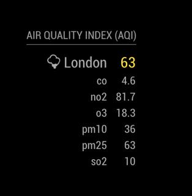
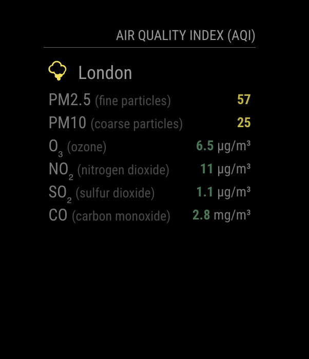
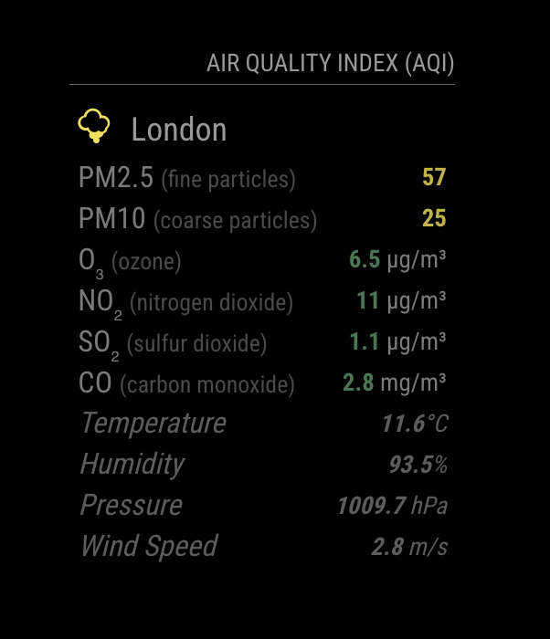
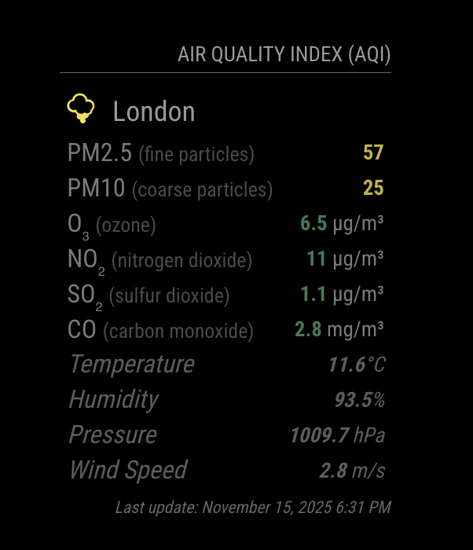

# MMM-AQI

**MMM-AQI** is a module for [MagicMirror²](https://github.com/MagicMirrorOrg/MagicMirror) to display the Air Quality Index (AQI) using the [World Air Quality Index](https://aqicn.org/json-api/doc/) project API.

<table>
	<tr>
		<td>
			<br>
			<sub>
				<pre><code>config: {
	iaqi: false,
	weather: false,
	showLastUpdate: false
}</code></pre>
			</sub>
		</td>
		<td>
			<br>
			<sub>
				<pre><code>config: {
	iaqi: true,
	weather: false,
	showLastUpdate: false
}</code></pre>
			</sub>
		</td>
	</tr>
</table>

<table>
	<tr>
		<td>
			<br>
			<sub>
				<pre><code>config: {
	iaqi: true,
	weather: true,
	showLastUpdate: false
}</code></pre>
			</sub>
		</td>
		<td>
			<br>
			<sub>
				<pre><code>config: {
	iaqi: true,
	weather: true,
	showLastUpdate: true
}</code></pre>
			</sub>
		</td>
	</tr>
</table>

## Installation

```bash
cd ~/MagicMirror/modules
git clone https://github.com/ryck/MMM-AQI
cd MMM-AQI
npm install
```

## Config

The entry in `config.js` can include the following options:

| Option                     | Description |
| -------------------------- | ----------- |
| `token`                    | **Required.** Your private API token ([see aqicn.org/data-platform/token/](https://aqicn.org/data-platform/token/))<br>**Type:** `string` |
| `city`                     | **Required.** Name of the city (e.g., `Beijing`), station id (e.g., `A7397`), or `here` to let WAQI infer your city via geolocation.<br>**Type:** `string`<br>**Default:** `here` |
| `iaqi`                     | Show individual AQI rows for pollutants (PM2.5, PM10, NO₂, CO, SO₂, O₃).<br>**Type:** `boolean`<br>**Default:** `true` |
| `weather`                  | Include temperature, humidity, pressure, and wind rows (when provided by WAQI).<br>**Type:** `boolean`<br>**Default:** `false` |
| `units`                    | Unit system for weather rows.<br>**Type:** `string`<br>**Possible values:** `metric`, `imperial`<br>**Default:** `metric` |
| `maxEntries`               | Maximum IAQI rows to render (useful if the API returns many pollutants).<br>**Type:** `integer`<br>**Default:** `10` |
| `showLastUpdate`           | Display the timestamp of the last successful update.<br>**Type:** `boolean`<br>**Default:** `true` |
| `overrideCityDisplayName`  | Force a custom label for the city instead of the API-provided name.<br>**Type:** `string \| null`<br>**Default:** `null` |
| `updateInterval`           | How often to refresh the AQI data (milliseconds).<br>**Type:** `integer`<br>**Default:** `30 * 60 * 1000` (30 minutes) |
| `initialLoadDelay`         | Delay the very first API request (milliseconds). Helpful when sharing API tokens between modules.<br>**Type:** `integer`<br>**Default:** `0` |
| `animationSpeed`           | Duration of DOM update animations (milliseconds).<br>**Type:** `integer`<br>**Default:** `1000` |
| `debug`                    | Log detailed information (API URLs, responses, etc.) to the MagicMirror console.<br>**Type:** `boolean`<br>**Default:** `false` |

Here is an example of an entry in `config.js`

```js
	{
		module: "MMM-AQI",
		position: "bottom_left",
		header: "Air Quality Index (AQI)",
		config: {
			token: "YOUR_TOKEN",
			city: "here",
			iaqi: true,
			weather: true,
			units: "metric",
			maxEntries: 6,
			showLastUpdate: true,
			overrideCityDisplayName: null,
			updateInterval: 30 * 60 * 1000,
			initialLoadDelay: 0,
			animationSpeed: 1000,
			debug: false
		}
	},
```

## Find your city

The API is quite picky with the cities, so your best option is to use the keyword _here_ or an id.
To find your id, just enter this URL in your browser:

[https://api.waqi.info/search/?token=TOKEN&keyword=CITY](https://api.waqi.info/search/?token=TOKEN&keyword=CITY)

**Note:** You need to replace _TOKEN_ and _CITY_ for your token (the same one you are using in the module works) and the city you are looking for, repectively.

## Thanks To...

- The [World Air Quality Index](https://aqicn.org/) project for providing the API.
- [Michael Teeuw](https://github.com/MichMich) for the [MagicMirror²](https://github.com/MagicMirrorOrg/MagicMirror/) framework that made this module possible.
